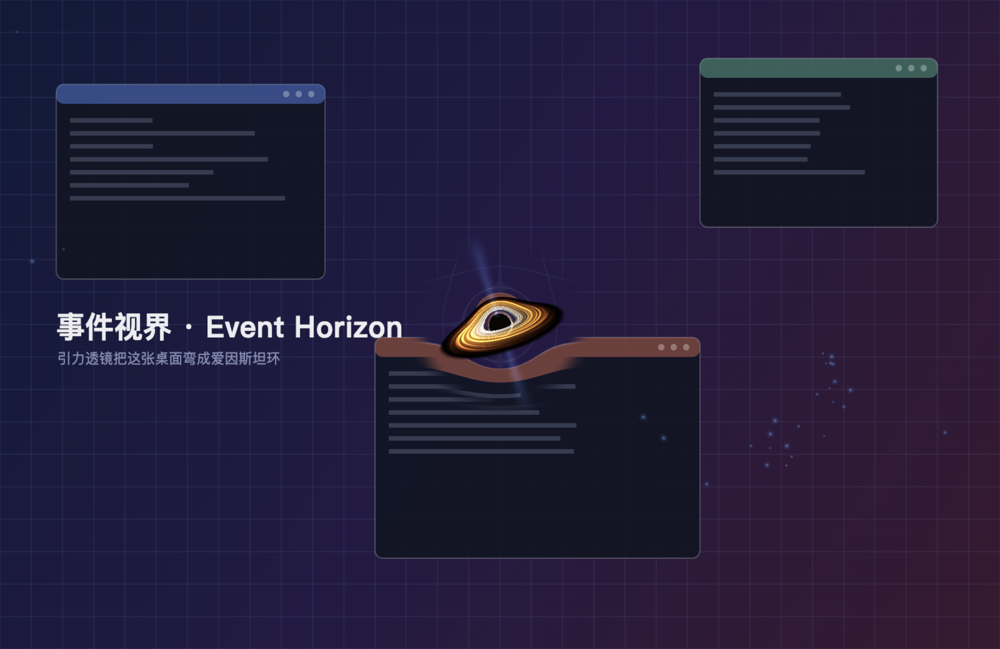

# 🕳️ 黑洞桌面宠物 · BlackHole Pet

一只住在你桌面上的史瓦西黑洞。它会**引力透镜**弯曲你真实的桌面、拖着旋转的**吸积盘**、
喷出极向**喷流**，还会把你丢给它的文件**撕碎吞噬**。

不是贴图动画 —— 每一帧都在片元着色器里对零测地线做数值积分。



---

## 快速开始

```bash
cd blackhole-pet
npm install
npm start
```

启动后它会出现在屏幕偏右下，鼠标穿透，不会挡你的操作。

> 第一次运行 macOS 可能会提示「屏幕录制」权限 —— 那是**引力透镜**需要的（见下文）。
> 不给也能正常玩，只是看不到桌面被弯曲的效果。

**如果 `npm start` 起不来**（被别的沙箱包着、或者环境里有 `ELECTRON_RUN_AS_NODE=1`），
用兼容模式：

```bash
npm run start:compat     # = env -u ELECTRON_RUN_AS_NODE electron . --no-sandbox
```

原因见文末《启动不了？先看这几条》。

---

## 它会做什么

| 效果 | 说明 |
| --- | --- |
| **引力透镜** | 抓取真实桌面快照，按史瓦西零测地线反向弯曲，形成爱因斯坦环 |
| **事件视界** | 纯黑的阴影，半径 = 临界碰撞参数 `b = 3√3/2 · Rs` |
| **光子环** | 近临界光线绕行多圈后被吸积盘反复照亮形成的一圈亮线 |
| **吸积盘** | 开普勒剪切把噪声拉成旋臂；相对论多普勒增亮让迎向你的那一侧明显更亮 |
| **极向喷流** | 被吞噬物质沿自转轴抛出的蓝白色喷流 |
| **吞噬** | 尘埃、你的鼠标轨迹碎屑、以及你投喂的真实文件，螺旋内落后被拉成面条 |
| **嗝** | 吃饱了会打个嗝（双击也能手动触发） |

---

## 怎么玩

| 操作 | 效果 |
| --- | --- |
| 把鼠标移到黑洞附近 | 出现状态面板（面板本身不吃鼠标事件） |
| **按住拖动** | 抓住中间那团黑影拖走（只有黑影本体吃鼠标，外面整圈吸积盘都不挡操作） |
| **双击** | 让它打个嗝（闪光 + 喷流爆发） |
| **⌥ + 滚轮** | 缩放体型（`⇧⌥` 微调）。**必须按 ⌥**，裸滚轮会原样放过，不会抢你底下的滚动 |
| **右键** | 全部设置菜单 |
| **把文件拖到窗口上** | 需要先开启「喂食模式」，见下 |
| `⌥⌘B` | 切换喂食模式 |
| `⌥⌘H` | 隐藏 / 显示 |
| 菜单栏托盘图标 | 点击隐藏 / 显示，右键打开完整菜单 |

### 关于尺寸和「挡操作」

默认档位的**阴影直径只有 34px**，但外面那圈吸积盘直径约是它的 5.8 倍（≈200px）——
看着小，实际铺开不小。觉得不合适：

- 右键 →「体型」四档（极小 / 小 / 中 / 大）
- **⌥ + 滚轮**无级调节
- 右键 →「允许鼠标拖动」关掉，它就彻底鼠标穿透，只剩观赏

**只有视界本体（中间那团黑影）会接管鼠标**：

- 热区半径 = **1.0 × 阴影半径**（默认档约 34px 直径），外面整圈吸积盘、喷流、泛光全部穿透
- 必须**悬停 150ms** 才会接管 —— 只是快速划过不会被抓走
- 退出热区有 0.25R 迟滞，光标在边缘抖动时不会反复夺还鼠标
- 滚轮只在按住 **⌥** 时响应，裸滚轮原样放过，不抢底下应用的滚动

还嫌碍事就直接右键 →「允许鼠标拖动」关掉，它永远不接管鼠标。

**泛光太亮？** 右键 →「泛光」四档（关 / 弱 / 中 / 强），默认「弱」。
默认档叠加到桌面上的光只有上一版的一半（实测 7.8 → 4.3），照射半径也从 6R 收到 5.2R。

**粒子太多 / 吞噬那一下太炸？** 右键 →「粒子数量」四档（关 / 少 / 中 / 大），默认「少」。

- 粒子上限 200（默认档 100），原来是不封顶地堆到 520
- 鼠标划过的掉屑概率 0.6/帧 → 0.10/帧，且要求速度 > 30px/s —— 原来是每秒几十颗
- 环境尘埃 2.2/秒 → 0.8/秒
- 吞噬爆炸实测**降低 85%**：叠加层上增加的光从 1,278,991 降到 198,173
  （火花 34 → 11 颗、速度减半、头部亮度 ×0.30、半径 ×0.55、整屏闪光 0.75 → 0.30）

爆炸的所有强度常量集中放在 `overlay.tuning` 里，不散落在绘制代码里当魔数 ——
调那一组就等于调「吞噬那一下有多炸」，`scripts/preview.js` 的 A/B 也是直接换这一组来测的。

### 关于移动速度和盘面浓淡

**嫌它晃得太快？** 右键 →「移动速度」四档（静止 / 慢 / 中 / 快），默认「中」。

自由漂浮的漂移速度从原来的**峰值 86 px/s 降到约 14 px/s**（实测 avg 13.8 / max 14.4），
横穿 1512px 的屏幕要一分半。原来的「对鼠标的好奇心」半径 340px、力度 46，
等于小半个屏幕都在它的追逐范围里，现在收到 200px / 力度 9。
`driftSpeed` 以前调的是相位频率（越调越快得离谱），现在改成直接调速度倍率。

**嫌吸积盘太淡 / 整个黑洞太透明？** 右键 →「吸积盘亮度」四档，默认「中」。

盘的密度原来是 `噪声 × 径向`，缝隙等于真空 —— 既淡（几缕游丝）又透（背后的桌面直接透出来）。

修的时候连着踩了两个坑，值得记一下。**「发光」和「光学厚度」必须拆成两个量，
而且它们的径向边界还要错开对方向**：

```glsl
// 发光：先淡出，它决定盘的"视觉边界"
radialEmit  = smoothstep(RIN, RIN+1.0, rr) * (1 - smoothstep(ROUT*0.55, ROUT*0.92, rr));
// 厚度：一直保持到更外面，保证淡出的那一段仍然是实的
radialThick = smoothstep(RIN, RIN+0.8, rr) * (1 - smoothstep(ROUT*0.90, ROUT,      rr));

emitting = radialEmit  × (0.32 + 0.80 × 丝状)   // 看起来多亮
dens     = radialThick × (0.85 + 0.30 × 丝状)   // 看起来多实
```

| 做法 | 结果 |
| --- | --- |
| 两者共用一条曲线 | 外圈亮度和厚度一起归零 → **一段半透明的纱** |
| 厚度先收、发光还在 | 盘突然消失 → **一圈硬切的椭圆边，像贴纸** |
| 发光先淡出、厚度后收 ✅ | 亮 → 逐渐暗下去 → 暗但仍不透明的外缘 → 厚度淡出 |

用同一条曲线时按半径量过：4.6R 处背景透出 **1.46 倍**、5.4R 处 **3.33 倍**、6.2R 处 **15.7 倍**。
现在的版本从 1.6R 到 4.6R 全线 **~1.0**（1.0 = 完全不透），盘面发光 151→162→150→75→19.5 是自然衰减。

> 量的时候别拿一个大方框套上去 —— 方框里大部分像素其实在盘**外面**，量到的是背景。
> 要沿盘的长轴取小方块，逐半径看分布；只看平均值会把「内圈不透、外圈全透」这种问题盖掉。

**关于「中心的黑色区域太圆」**：施瓦西黑洞的阴影投影**本来就是正圆**，这部分没画错。
看起来假是因为两点，都修了：

1. **前景盘没有挡住视界**。盘原来是半透的，近侧那块只是"叠加"在阴影上而不遮挡它，
   所以圆边完整。现在盘光学厚了，近侧会实打实盖住阴影 ——
   实测视界内部（半径 0.92R 的圆内）**45% 的像素被前景盘点亮**，不再是一个完整的圆。
2. **光子环是均匀亮环**。加了多普勒不对称（`1 + 0.65 × sp.x`，迎向观察者的一侧更亮），
   破掉那个"规规矩矩画上去的圆"的感觉。

另外光子环不再跟着「泛光」设置一起被砍 —— 泛光管的是外围那圈大范围光晕，
光子环是视界边缘本身，之前被一起降掉也是盘看着发淡的原因之一。

### 投喂它

三种方式：

1. **右键 → 投喂文件…**（最稳，直接弹出文件选择框）
2. **托盘菜单 → 投喂文件…**
3. **喂食模式**（`⌥⌘B` 或右键菜单打开）—— 打开后整个屏幕都是可拖放区域，
   直接从访达把文件拖进去。再按一次 `⌥⌘B` 退出。

被丢进去的文件会带着名字和图标飞向黑洞，越靠近被拉得越长，最后炸成火花消失。

---

## 吞噬的安全设计

默认**不会真的删除**你的文件。

- 文件会被**移动到隔离区**：`~/BlackHolePet/eaten/`
  （重名会自动加时间戳，跨磁盘会退化成复制+删除）
- 每一次吞噬都写进流水账：`~/BlackHolePet/journal.jsonl`
- 右键菜单 →「打开隔离区」可以随时把它们捞回来
- 只有把「吞噬方式」切成**永久删除**才会 `rm`，这一项默认关闭

**永远不会碰**（硬编码白名单之外还有黑名单）：

```
/System  /Library  /Applications  /usr  /bin  /sbin  /private
/etc  /var  /opt  /Volumes  /cores  /dev  ~  ~/BlackHolePet
```

另外：**目录不会被吞噬**、**符号链接不会被吞噬**、主目录本身不会被吞噬。
吞不掉的东西会明确告诉你原因，不会静默失败。

---

## 引力透镜与「屏幕录制」权限

黑洞要把你真实的桌面弯给你看，就必须先读到它 —— 用的是 Electron 的
`desktopCapturer`，也就是 macOS 的**屏幕录制**权限。

- 已授权：启动时抓一张干净快照，之后黑洞移动超过 160px 会悄悄换一张新的
- 未授权：状态面板会出现一行「开启引力透镜需要屏幕录制权限 去设置」，点它直接跳到系统设置
- 不想给权限：右键关掉「引力透镜背景」，黑洞会退化成一层极淡的暗雾，依然好看

> 窗口开了 `setContentProtection(true)`，所以**它自己不会被自己抓到**，
> 不会出现无限递归的画面。副作用是：你用系统截图时，这只黑洞不会出现在你的截图里。

---

## 渲染与物理

`renderer/shaders.js` 是全部的秘密。几何单位取史瓦西半径 `Rs = 1`：

```
事件视界      r = 1
光子球        r = 1.5
临界碰撞参数  b = 3√3/2 ≈ 2.598   →  阴影半径
ISCO          r = 3
```

每条光线从相机出发，用零测地线的标准近似做蛙跳积分：

```
a = -1.5 · h² · r / |r|⁵        (h = r × v，沿测地线守恒)
```

- 落入视界 → 输出纯黑
- 逃逸 → 把最终方向**反投影回屏幕**采样桌面纹理

因为视场角是按 `sp=1 ⇔ b=b_crit` 标定的，**没有被弯曲的光线采样到的正好是它自己那一像素**，
所以桌面快照能跟真实桌面严丝合缝地接上，只有黑洞附近才看得出扭曲。

途中每次穿过赤道面就采一次吸积盘，于是「盘从黑洞上方绕过去」的经典画面、
以及光子环附近的二重像都是**自然涌现**的，不是画上去的。

**性能**：远处像素会立即逃逸（步长 `∝ r`），只有临界光线才需要跑满步数；
渲染区域限制在 `lensRadius × 阴影半径` 内，区域外直接丢弃。
再加上自适应分辨率（0.45×~1.0×），默认 30fps 待机 / 60fps 交互。

---

## 设置项

`~/Library/Application Support/blackhole-pet/settings.json`，也可以右键菜单改：

| 键 | 默认 | 说明 |
| --- | --- | --- |
| `size` | `small` | 阴影直径 极小 22 / 小 34 / 中 50 / 大 74 px |
| `quality` | `auto` | `auto` 会按帧耗时自动调分辨率与步数 |
| `lensRadius` | `9` | 引力透镜影响半径（单位：阴影半径） |
| `follow` | `free` | `free` 自由漂浮 / `follow` 跟随鼠标 / `fixed` 固定中央 |
| `inclination` | `0.30` | 相机仰角（弧度），越大吸积盘越"正面" |
| `roll` | `-0.30` | 吸积盘在屏幕上的倾角 |
| `jets` | `0.65` | 喷流强度，设 0 关闭 |
| `diskBright` | `1.35` | 吸积盘亮度：0.7 弱 / 1.35 中 / 2.0 强 / 2.8 极强 |
| `driftSpeed` | `1` | 自由漂浮速度倍率：0 静止 / 0.5 慢 / 1 中 / 2 快 |
| `bgCapture` | `true` | 是否做桌面引力透镜 |
| `autoRefreshBg` | `true` | 移动后是否自动换新快照 |
| `eatMode` | `quarantine` | `quarantine` 隔离区 / `delete` 永久删除 |
| `hud` | `true` | 状态面板 |
| `interactive` | `true` | 设 `false` 则永远鼠标穿透，纯当装饰 |
| `glow` | `0.45` | 泛光强度倍率：0 关 / 0.45 弱 / 1 中 / 1.6 强 |
| `particles` | `0.5` | 粒子密度倍率：0 关 / 0.5 少 / 1 中 / 2 多（同时控制环境尘埃、鼠标碎屑、爆炸火花） |

### 改默认值要记得升版本

`settings.json` 会覆盖代码里的默认值。所以改了任何默认值（比如把默认体型从「中」改成「小」），
老用户机器上的存档会把它原样压回去 —— 改了等于没改，还以为是代码写错了。

`lib/settings.js` 就是干这个的：版本号 +1，并声明哪些键要拉回新默认值，
其余用户明确选过的偏好（`eatMode`、`hud`……）原样保留。有 9 个回归测试盯着
（`scripts/test-settings.js`）。

---

## 目录结构

```
blackhole-pet/
├── main.js                 主进程：透明置顶窗口、光标轮询、桌面抓取、吞噬文件、托盘
├── preload.js              contextBridge 白名单，渲染层碰不到 fs
├── .npmrc                  Electron 二进制走 npmmirror 镜像（GitHub 下不动时用）
├── start.sh                受限环境启动器（绕开 node 包装、正确摆放 --no-sandbox）
├── lib/
│   ├── devour.js           ★ 吞噬安全策略（唯一不可逆的操作，独立可测）
│   └── settings.js         ★ 设置存档版本与迁移（防止改默认值不生效）
├── renderer/
│   ├── index.html
│   ├── style.css
│   ├── shaders.js          ★ GLSL：测地线积分 + 吸积盘 + 喷流 + 光子环
│   ├── gl.js               WebGL 封装、自适应画质
│   ├── overlay.js          2D 粒子：引力捕获、螺旋内落、潮汐拉伸、文件碎屑
│   └── app.js              行为、交互、菜单、主循环
├── build/
│   ├── icon.icns           应用图标（由黑洞自己的渲染结果生成）
│   └── 安装说明.txt         会一起打进 dmg
└── scripts/
    ├── build-mac.sh        ★ 一条命令产出 dmg + zip
    ├── make-icon.js        渲染应用图标 → icns
    ├── preview.js          离屏渲染预览图 + 帧缓冲像素探针
    ├── smoke.js            最小化 Electron 冒烟测试
    ├── test-devour.js      吞噬安全逻辑回归测试（纯 Node，13 例）
    └── test-settings.js    设置迁移回归测试（纯 Node，9 例）
```

### 跑测试

```bash
npm test        # 22 个用例：隔离区/永久删除/目录/软链/系统路径/重名/流水账 + 设置迁移
```

`lib/devour.js` 是整个项目里唯一会搬走或删掉用户文件的地方，所以它被刻意
做成了不依赖 Electron 的纯 Node 模块 —— 这样删文件的逻辑随时都能单独验证，
不用先把那个飘忽的 Electron 窗口伺候起来。

### 单独渲染一张预览图

```bash
npx electron scripts/preview.js
# → preview.png          整屏效果
# → preview-hole.png     黑洞特写
```

它会铺一张程序生成的假桌面（带窗口和网格，方便看清畸变），跑几十帧后截图，
同时打印 GPU 型号、实测帧率，以及**直接从帧缓冲读回来的像素探针**。
**注意：会有一个大约 3% 不透明度的窗口闪一下**（约 4 秒）。

`scripts/smoke.js` 是最小化的「起窗口 + 截图」测试，用来区分
「是我的代码坏了」还是「Electron 根本起不来」。

### 调试通道

```js
window.__petDebug = 1   // 红点=视界中心，蓝=被视界捕获，绿=吃到吸积盘，灰带=每 1 个阴影半径的等高线
window.__petDebug = 2   // 坐标场：R=frag.x/uRes.x，G=frag.y/uRes.y；红/青/黄点标 uCenter / 右上角 / 原点
window.__petDebug = 0   // 关掉
```

`window.__pet` 暴露了 `S`（状态）、`gl`（渲染器）、`overlay`（粒子层）；
`window.__petdbg()` 一次吐出所有关键值，**包括 GPU 上真实生效的 uniform**
（`gl.getUniform` 读回，绕过"我明明传了值"这种自欺欺人）。
渲染出问题时用这两个定位，比盯着截图猜快得多。

> 这个项目就是靠它们抓到两个真 bug 的：
> ① `canvas { position: fixed; inset: 0 }` 对**替换元素**不生效，canvas 会退回内在尺寸，
> 在高 DPI 屏上被放大 devicePixelRatio 倍，黑洞直接被推出可视区；
> ② 自动画质原来量的是 CPU 提交耗时（WebGL 是异步的，永远是 0.几毫秒），
> 改成量真实帧间隔后才真的会降档。

---

## 打包 / 分发给别的电脑

```bash
npm run dist:mac
```

产出（`dist/`）：

| 文件 | 用途 |
| --- | --- |
| `黑洞宠物-1.0.0-mac-universal.dmg` (241MB) | 双击挂载，把 app 拖进 Applications |
| `黑洞宠物-1.0.0-mac-universal.zip` (219MB) | 解压后同样拖进 Applications |

**universal** = 同时含 `arm64` 和 `x86_64`，Intel 和 Apple 芯片的 Mac 都能跑。
体积大是因为 Electron Framework 被塞了两份，属正常。

### 自动打包（GitHub Actions）

也可以交给 CI 打（`.github/workflows/build-mac.yml`）：

- **打 tag 自动发布** —— `git tag v1.0.1 && git push origin v1.0.1`
- **手动触发** —— Actions →「构建 macOS 安装包」→ Run workflow
  （`tag` 留空 = 只构建不发布，产物在 run 页面的 Artifacts 里，保留 14 天）

流程：`npm ci` → `npm test` → `npm run dist:mac` → 校验 dmg 完整性 + ad-hoc 签名
→ 生成 `SHA256SUMS.txt` → 上传 Release。

> **两个 CI 特有的坑，workflow 里已经处理掉：**
>
> 1. **产物名必须是 ASCII。** GitHub 会剥离 Release 资源名里的中文字符，
>    `黑洞宠物-1.0.0-mac-universal.dmg` 会被削成 `-1.0.0-mac-universal.dmg`
>    （开头一个横杠，终端里没法直接用）。所以 CI 里设
>    `ARTIFACT_NAME=BlackHolePet`，产出 `BlackHolePet-<版本>-mac-universal.*`。
>    本地不设这个变量，产物名保持中文不变。
> 2. **Electron 镜像。** 项目里的 `.npmrc` 把镜像指向 npmmirror（本机直连
>    GitHub 慢）。CI 跑在美国，workflow 用 `ELECTRON_MIRROR` 环境变量覆盖回
>    GitHub 官方源，否则下载会很慢甚至超时。

### 关于签名，有个坑

`electron-builder` 自带的 `dmg`/`zip` target 是**在签名之前**打包的，而它默认不签名
（没买 Apple 开发者证书）。结果安装包里的 app 只有**链接器级别**的 ad-hoc 签名：

```
Identifier=Electron          ← 不是 bundle id
Info.plist=not bound         ← plist 没绑进签名
Sealed Resources=none        ← 资源没封存
```

这种 app 在 macOS 上会被直接拒绝启动。所以 `build-mac.sh` 的流程是：

```
出未签名的 .app  →  codesign --force --deep --sign -  →  再打 dmg / zip
```

签名后的校验结果：

```
Identifier=com.renxiaodong.blackholepet
Signature=adhoc
Sealed Resources version=2 rules=13 files=10
$ codesign --verify --deep --strict → valid on disk / satisfies its Designated Requirement
```

### 另一台电脑第一次打开会被拦

因为没买 Apple 开发者证书（99 美元/年），系统会提示「无法验证开发者」。
dmg 里附了 `安装说明.txt`，两种解法：

- 在「应用程序」里 **Control + 点击** →「打开」→ 再点一次「打开」
- 或者 `xattr -dr com.apple.quarantine "/Applications/黑洞宠物.app"`

想彻底免掉这一步，就得：

```bash
export CSC_LINK=/path/to/cert.p12
export CSC_KEY_PASSWORD=...
# 并去掉 build-mac.sh 里的 CSC_IDENTITY_AUTO_DISCOVERY=false
```

再配上 Apple ID 做公证（`@electron/notarize` 已随 electron-builder 装好）。

### 图标

不是另外画的，是**黑洞自己渲染出来的**：

```bash
npm run icon     # → build/icon-1024.png（1024 主图）+ build/icon.icns
```

`scripts/make-icon.js` 会把黑洞居中、关掉桌面纹理、冻住粒子，
套一张 824×824 圆角 185 的底板（macOS Big Sur 之后的图标规范），
截图后走 `sips` + `iconutil` 转成 icns。

### 打包时需要下载的东西

`electron-builder` 要下 universal 的两份 Electron（arm64 + x64）。
GitHub 下不动的话已经在 `.npmrc` 配了 npmmirror 镜像；
缓存全部留在项目内的 `.builder-cache/`（有些环境不允许写 `~/Library/Caches`）。

> 如果卡在 `EPERM: mkdir '~/Library/Caches/electron'`：
> `@electron/get` 落地那一步用的是 `os.homedir()`，
> 临时把 `HOME` 指到可写目录即可 —— `build-mac.sh` 里的
> `ELECTRON_BUILDER_CACHE` 已经覆盖了大部分，极端环境下再补一个 `HOME`。

---

## 常见问题

**会不会很耗电？**
待机 30fps + 自适应降分辨率。真嫌费电：右键 →「画质 → 低」，或者关掉「引力透镜背景」
（关掉后着色器不再做纹理采样和背景反投影，省一大截）。合盖前直接 `⌥⌘H` 隐藏即可。

**多显示器？**
目前只覆盖主显示器。想换屏就在系统设置里改主显示器再重启它。

**怎么彻底卸载？**
删掉 `blackhole-pet` 文件夹、`~/BlackHolePet/`（隔离区 + 流水账）、
以及 `~/Library/Application Support/blackhole-pet/`（设置）。

**为什么它不在我的截图里？**
见上文 `setContentProtection`。想让它出现在截图里，把 `main.js` 里那一行注释掉即可。

---

## 启动不了？先看这几条

**1. `npm install` 卡在 electron 下载 / 报 `fetch failed`**

Electron 的二进制不在 npm registry 上，默认从 GitHub Releases 拉，国内常年超时。
项目里已经带了 `.npmrc`：

```ini
electron_mirror=https://cdn.npmmirror.com/binaries/electron/
```

如果还不行，手动装一次（`electron_config_cache` 是 @electron/get 真正认的变量名）：

```bash
electron_config_cache="$PWD/.electron-cache" \
ELECTRON_MIRROR="https://cdn.npmmirror.com/binaries/electron/" \
  node node_modules/electron/install.js

# 验证
ls node_modules/electron/dist/Electron.app
```

**2. 报 `sandbox initialization failed: Operation not permitted`，或者进程直接 SIGTRAP 挂掉**

说明当前 shell 环境不允许 Chromium 自带的沙箱初始化
（被别的沙箱/容器包着、或者没有 GUI 会话权限时很常见）。
加 `--no-sandbox` 就能跑：

```bash
./node_modules/.bin/electron . --no-sandbox
```

普通终端里 `npm start` 不需要它 —— 别没事就加，那是在削弱 Chromium 的沙箱。

**3. 报 `Cannot read properties of undefined (reading 'commandLine')`**

你有 `ELECTRON_RUN_AS_NODE=1` 这个环境变量（某些 Electron 应用会往外设），
它会让 Electron 退化成纯 Node 跑。去掉再启动：

```bash
env -u ELECTRON_RUN_AS_NODE ./node_modules/.bin/electron .
```

**4. 窗口起来了但什么都没有**

先确认显卡路径没问题：

```bash
PET_DEBUG=1 ./start.sh --no-sandbox
```

它会把渲染层的 console 转发到终端。有 `shader 编译失败` 之类的报错就直接贴出来。
另外 `./start.sh --entry scripts/smoke.js --no-sandbox` 能告诉你 Electron 本身是否正常。

**5. `--no-sandbox` 加了也没用，进程还是一声不响地 SIGTRAP**

Chromium 只认 **app 路径之前**的开关：

```bash
electron --no-sandbox .        # ✅ 开关生效
electron . --no-sandbox        # ❌ 被当成 app 自己的参数，沙箱照样起不来
```

`start.sh` 已经帮你把顺序摆对了。

另外：在被别的沙箱包着的环境里，这个崩溃是**间歇性**的
（Chromium 的子进程和宿主沙箱抢 seatbelt），重试几次通常就能起来。
正因如此，删文件那部分逻辑被刻意做成了不依赖 Electron 的纯 Node 模块 ——
验证它不必赌运气。

---

## 调参建议

想让它更像《星际穿越》的卡冈图雅：把 `inclination` 调到 `0.12` 左右（几乎侧视），
`lensRadius` 提到 `12`，`diskBright` 拉到 `2.0`。

想让它更"黑洞"而不是"土星"：`jets` 设 `0.25`，`roll` 设 `-0.55`。

想让它彻底安静：`driftSpeed` 设 `0` + 「允许鼠标拖动」关掉 ——
就是一个纯观赏的、完全不碰鼠标的黑洞。
